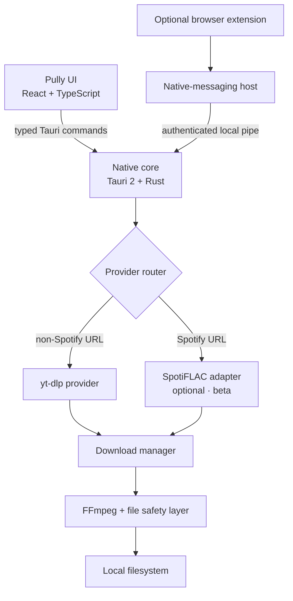

<div align="center">
  

  <h1>Pully</h1>

  <p><strong>Media, without the mess.</strong></p>
  <p>Paste a link, choose what you want, and save it locally.</p>

  <p>
    <a href="#building-from-source">Build from source</a> ·
    <a href="#documentation">Documentation</a> ·
    <a href="https://github.com/Maticcm/Pully/issues/new">Report a bug</a>
  </p>

  <p>
    
    <a href="LICENSE"></a>
    
    <a href="https://tauri.app"></a>
  </p>
  <p>
    <a href="https://ko-fi.com/maticcukmikeln"></a>
  </p>
</div>

<!--
  Screenshot target: docs/assets/pully-home.png
  Add a current, real capture of the home screen here before the first public release.
-->

Pully replaces ad-heavy downloader pages with a focused desktop workflow. It shows the formats a source actually exposes, lets you choose the result, and saves it to a folder you control.

The React interface talks to a native Rust backend; provider tools run on your computer and downloaded media goes directly to local storage. There is no Pully account, analytics service, or cloud processing layer. Provider tools still connect to the source service when you ask Pully to analyze or download media.

Service-specific behavior stays behind a provider boundary. Most links use yt-dlp, while Spotify track, album, and playlist links are routed to an isolated, optional SpotiFLAC adapter.

## Features

| | |
|---|---|
| **Video**<br>Choose an available resolution, keep or reduce the source frame rate, pair video-only streams with audio, and output MP4, WebM, MKV, MOV, or the original container. | **Audio**<br>Extract or convert to MP3, M4A, AAC, Opus, Ogg Vorbis, FLAC, ALAC, WAV, or keep the original format. |
| **Playlists and collections**<br>Download playlists, albums, and channels as one queue job, optionally group them in a folder, and keep successful items when part of a collection fails. | **Metadata and extras**<br>Embed metadata and thumbnails, save artwork separately, and download or embed available manual and automatic subtitles. |
| **Quick Mode**<br>Analyze and queue a link in one action using a dedicated video/audio, quality, format, metadata, thumbnail, and subtitle preset. | **Download manager**<br>Run 1–6 jobs concurrently with live progress, size, speed, ETA, processing states, cancellation, retry, open, and reveal actions. |
| **Desktop workflow**<br>Paste or drag in links, send saved `.url` shortcuts from Explorer, keep Pully in the system tray, and continue downloads in the background. | **Personalization**<br>Choose light, dark, or system mode; select a bundled font and base color; and set any accent color. Motion respects the operating system's reduced-motion preference. |

See the [complete feature reference](features.md) for the full implemented scope and known limitations.

## Three steps

| 1. Paste | 2. Choose | 3. Pull |
|:---:|:---:|:---:|
| Add a media URL by paste, drag and drop, or browser integration. | Review the available mode, quality, frame rate, format, and extras. | Queue the download and let Pully handle merging, conversion, and file placement. |

## Supported services

Pully supports media sources available through its installed providers:

- **yt-dlp** handles non-Spotify links. Compatibility follows the installed yt-dlp version; see its [supported-sites reference](https://github.com/yt-dlp/yt-dlp/blob/master/supportedsites.md) for the current extractor list.
- **SpotiFLAC** handles Spotify track, album, and playlist URLs through a separate **beta/experimental** integration. Pully requires the current CLI contract, explicitly requests its lossless mode, and only accepts output with a valid FLAC signature. Setup and provider boundaries are documented in [SpotiFLAC integration](docs/SPOTIFLAC.md).

Availability can vary by source and media item. Pully does not implement DRM, authentication, subscription, or access-control bypasses. Only download media you are permitted to save.

## Browser integration

The optional Chromium extension removes the copy-and-paste step:

**Open supported media in Chrome, Brave, or Edge** → **Pully detects the tab locally** → **select it in Pully** → **review or Quick Download**

The extension communicates through a native-messaging host and a same-user local named pipe. Tab URLs, titles, and favicons are held in memory and are not sent to a Pully server. Browser integration is off by default and requires both the unpacked extension and the in-app setting; there is not yet a Chrome Web Store release.

The implementation and automated protocol tests are present, but the documented real-browser manual test checklist is still pending. See [Browser Integration](docs/BROWSER_INTEGRATION.md) for architecture, permissions, development setup, and current validation status.

## Private by design

- No account, advertising, analytics SDK, telemetry, crash reporter, or remote Pully service.
- The frontend Content Security Policy blocks outbound web requests; media providers and the optional app updater make their own HTTPS requests.
- Preferences stay in local storage. Download history is not persisted, and detected browser tabs live in memory only.
- Missing yt-dlp and FFmpeg binaries are downloaded only after an explicit **Install automatically** action. SpotiFLAC can be installed from Settings. App updates check GitHub Releases on startup and daily by default, then install signed updates when Pully is idle; this can be disabled in Settings.

Read [Privacy](docs/PRIVACY.md) for the exact network, storage, and browser-extension behavior.

## Download Pully

Download the Windows installer or standalone ZIP from [GitHub Releases](https://github.com/Maticcm/Pully/releases). Pully is currently pre-release. The standalone ZIP includes the download tools; extract it fully and run `pully.exe`.

### Publishing app updates

Version 0.1.1 adds signed app updates. The first updater-enabled installer must be installed manually. Later signed releases install automatically when Pully is idle (unless disabled in Settings > Status).

Keep the private updater signing key backed up outside the repository. Set `TAURI_SIGNING_PRIVATE_KEY_PATH` to that file and `TAURI_SIGNING_PRIVATE_KEY_PASSWORD` to its password (an empty string for a passwordless key). Build with `npm run tauri build -- --bundles nsis --config src-tauri/tauri.local-sign.conf.json`, run `node scripts/sign-installer.cjs`, then run `powershell -File scripts/create-update-manifest.ps1`. Upload the generated NSIS installer, its `.sig` file, and `latest.json` to a GitHub Release tagged with the same `v<version>`. Commit the generated `updates/latest.json` feed to `main` after uploading the release assets; this feed supports prereleases as well as stable releases. Update `package.json`, `src-tauri/Cargo.toml`, and `src-tauri/tauri.conf.json` together for each new release. Do not rotate the key without a migration plan: installed copies trust the public key embedded in the app.

## Building from source

### Requirements

- Windows
- Node.js with npm
- A Rust toolchain
- yt-dlp and FFmpeg available on `PATH` for development
- Optional: SpotiFLAC 4.1.2 or newer for Spotify links

```powershell
git clone https://github.com/Maticcm/Pully.git
cd Pully
npm install
npm run tauri dev
```

Development builds discover provider tools on `PATH`. Pully can also use trusted binaries placed in its bundled resources or app-data tools directory. SpotiFLAC is optional; without it, only Spotify links are unavailable.

For a release-style Windows build, prepare the provider sidecars explicitly, then build the Tauri bundle:

```powershell
.\scripts\prepare-sidecars.ps1 `
  -YtDlp C:\path\to\yt-dlp.exe `
  -Ffmpeg C:\path\to\ffmpeg.exe `
  -SpotiFlac C:\path\to\spotiflac.exe

npm run tauri build
```

`-SpotiFlac` is optional. Browser-integration releases also need the native-messaging host beside Pully; follow the [release build instructions](docs/BROWSER_INTEGRATION.md#release-builds). Maintainers bundling FFmpeg should review the applicable obligations in [Third-party licenses](THIRD_PARTY_LICENSES.md).

### Checks

```powershell
npm run lint
npm run build
cargo fmt --manifest-path src-tauri/Cargo.toml --check
cargo clippy --manifest-path src-tauri/Cargo.toml --all-targets
cargo test --manifest-path src-tauri/Cargo.toml
```

If you change the browser extension:

```powershell
cd browser-extension
npm install
npm run typecheck
npm run build
```

## Architecture



URLs are validated before routing. Providers expose a shared media model to the UI, while the download manager owns queueing, cancellation, progress, post-processing, and final file placement.

## Tech stack

| Layer | Technology |
|---|---|
| Desktop runtime | Tauri 2 |
| Native core | Rust, Tokio |
| Interface | React 18, TypeScript, Vite, Tailwind CSS |
| Interaction | Motion for React, Radix Primitives |
| Media providers | yt-dlp; optional SpotiFLAC adapter |
| Post-processing | FFmpeg |
| Browser bridge | Manifest V3 extension, native messaging, local named pipe |

## Documentation

- [Features](features.md) — implemented capabilities and limitations
- [Privacy](docs/PRIVACY.md) — network activity, local storage, and browser data
- [Browser Integration](docs/BROWSER_INTEGRATION.md) — architecture, permissions, setup, and test status
- [SpotiFLAC integration](docs/SPOTIFLAC.md) — supported CLI contract and provider boundary
- [Contributing](CONTRIBUTING.md) — setup, checks, and architecture rules
- [Security](SECURITY.md) — threat model and vulnerability reporting
- [Third-party licenses](THIRD_PARTY_LICENSES.md) — runtime tools and dependency licensing

## Contributing

Issues and pull requests are welcome. For non-trivial changes, open an issue first so the approach can be agreed before implementation. Read [CONTRIBUTING.md](CONTRIBUTING.md) and run the documented checks before submitting a PR.

## Security

Please do not disclose vulnerabilities in a public issue. Use GitHub's **Security** tab to [report a private vulnerability](https://github.com/Maticcm/Pully/security/advisories/new), following [SECURITY.md](SECURITY.md).

## License

Pully is licensed under [GPL-3.0-or-later](LICENSE). Runtime tools and third-party packages retain their own licenses; see [THIRD_PARTY_LICENSES.md](THIRD_PARTY_LICENSES.md).

<p align="center"><sub>Pully — Media, without the mess.</sub></p>
